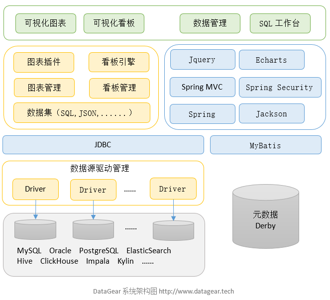
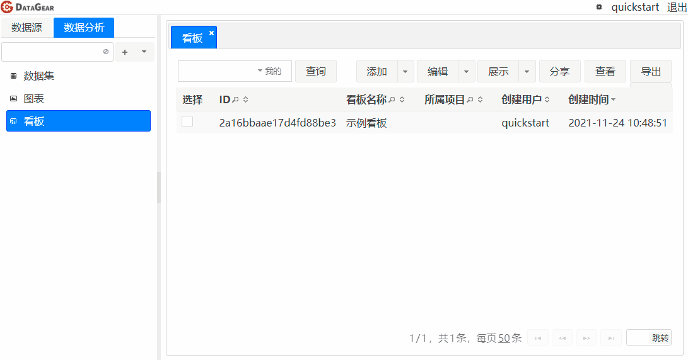
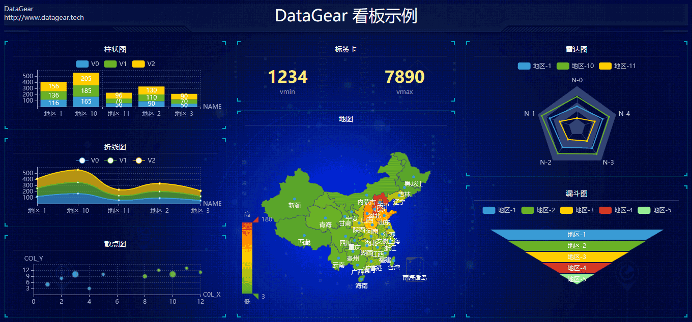
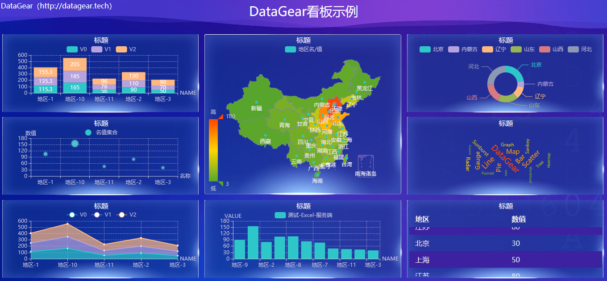
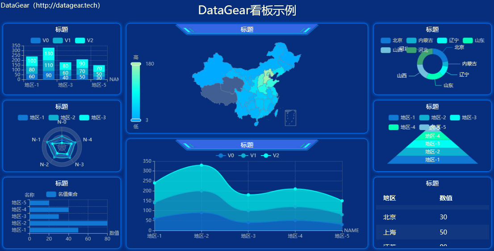
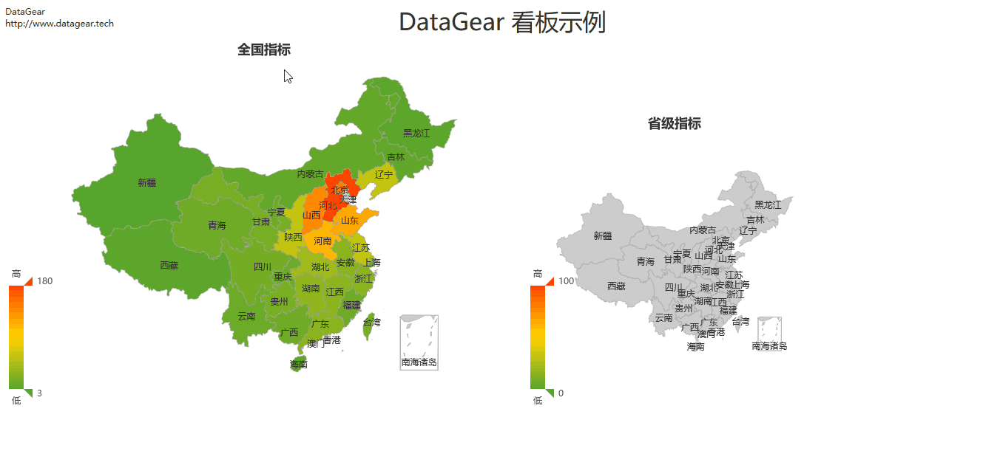
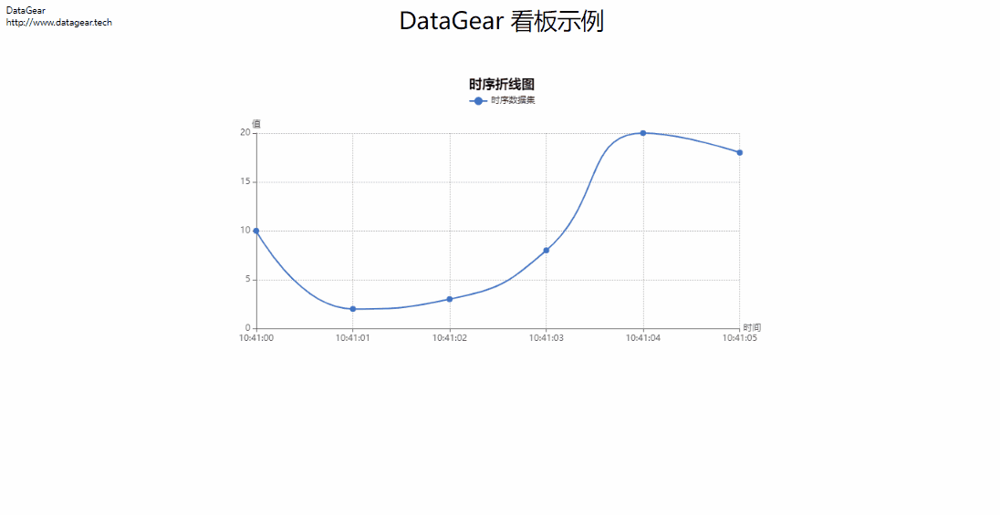
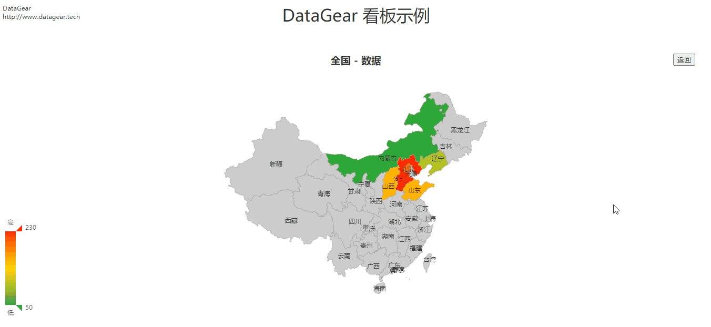
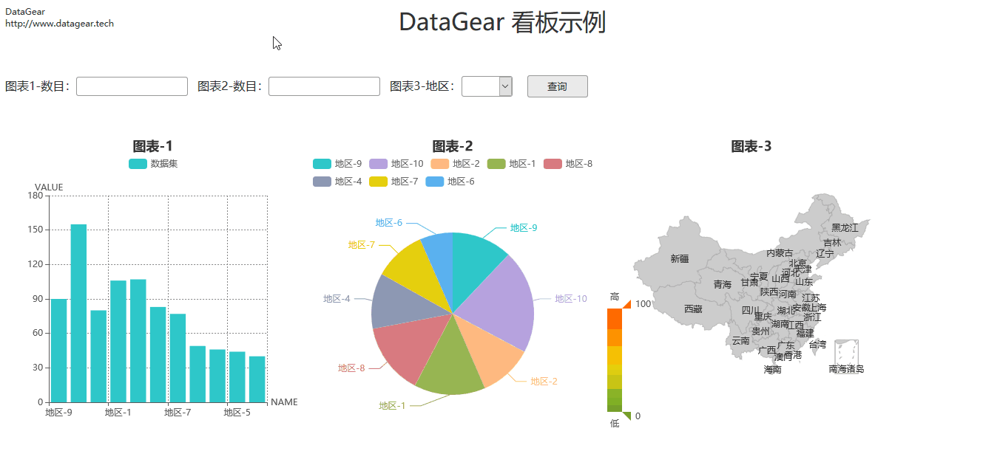
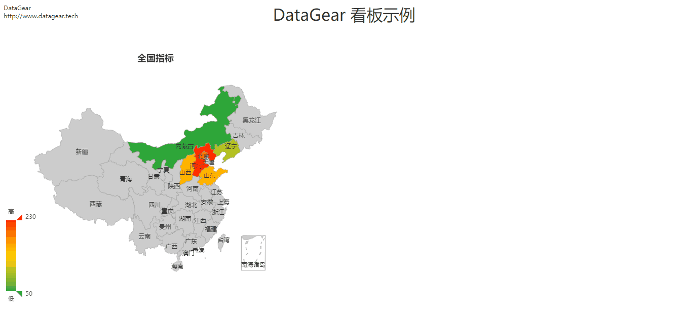

	

<h1 align="center">
	数据可视化分析平台
</h1>
<h2 align="center">
	自由制作任何您想要的数据看板
</h2>

# 简介

DataGear是一款开源免费的数据可视化分析平台，自由制作任何您想要的数据看板，支持接入SQL、CSV、Excel、HTTP接口、JSON等多种数据源。

系统基于Spring Boot、Jquery、Vue3、PrimeVue、ECharts等技术开发。

## [DataGear 3.2.0 已发布，欢迎官网下载使用！](http://www.datagear.tech)

## [DataGear 大屏看板模板，持续更新中...](https://gitee.com/datagear/DataGearDashboardTemplate)

## 系统特点

- 友好接入的数据源
 支持运行时接入任意提供JDBC驱动的数据库，包括MySQL、Oracle、PostgreSQL、SQL Server等关系数据库，以及Elasticsearch、ClickHouse、Hive等大数据引擎

- 多样动态的数据集
 支持创建SQL、CSV、Excel、HTTP接口、JSON数据集，并可设置为动态的参数化数据集，可定义文本框、下拉框、日期框、时间框等类型的数据集参数，灵活筛选满足不同业务需求的数据

- 强大丰富的数据图表
 数据图表可聚合绑定多个不同格式的数据集，轻松定义同比、环比图表，内置折线图、柱状图、饼图、地图、雷达图、漏斗图、散点图、K线图、桑基图等70+开箱即用的图表，并且支持自定义图表配置项，支持编写和上传自定义图表插件

- 自由开放的数据看板
 数据看板采用原生的HTML网页作为模板，支持导入任意HTML网页，支持以可视化方式进行看板设计和编辑，也支持使用JavaScript、CSS等web前端技术自由编辑看板源码，内置丰富的API，可制作图表联动、数据钻取、异步加载、交互表单等个性化的数据看板。

## 架构图

## 官网

[http://www.datagear.tech](http://www.datagear.tech)

## 文档

[http://www.datagear.tech/documentation](http://www.datagear.tech/documentation)

## 示例

[https://my.oschina.net/u/4035217](https://my.oschina.net/u/4035217)

## 源码

Gitee：[https://gitee.com/datagear/datagear](https://gitee.com/datagear/datagear)

Github：[https://github.com/datageartech/datagear](https://github.com/datageartech/datagear)

## 交流

QQ群：[916083747（已满）](https://jq.qq.com/?_wv=1027&k=ODxiKOOy)、[1128360199（已满）](https://jq.qq.com/?_wv=1027&k=XkQ4ARMY)、[541252568](https://jq.qq.com/?_wv=1027&k=F7dwDVLO)

留言板：[http://www.datagear.tech/messageboard](http://www.datagear.tech/messageboard/)

## 界面

图表类型

看板-可视编辑模式

看板展示

看板展示-图表联动

看板展示-实时图表

看板展示-钻取

看板展示-表单

看板展示-联动异步加载图表

## 模块介绍

- datagear-analysis
   数据分析底层模块，定义数据集、图表、看板API

- datagear-connection
   数据库连接支持模块，定义可从指定目录加载JDBC驱动、新建连接的API

- datagear-dataexchange
   数据导入/导出底层模块，定义导入/导出指定数据源数据的API

- datagear-management
   系统业务服务模块，定义数据源、数据分析等功能的服务层API

- datagear-meta
   数据源元信息底层模块，定义解析指定数据源表结构的API

- datagear-persistence
   数据源数据管理底层模块，定义读取、编辑、查询数据源表数据的API

- datagear-util
   系统常用工具集模块

- datagear-web
   系统web模块，定义web控制器、操作页面

## 依赖

	Java 8+
	Servlet 3.1+

## 编译

### 准备单元测试环境

1. 安装 MySQL-8.0 数据库，并将`root`用户的密码设置为：`root`（或者修改`test/config/jdbc.properties`配置）

2. 新建测试数据库，名称取为：`dg_test`

3. 使用`test/sql/test-sql-script-mysql.sql`脚本初始化`dg_test`库

### 执行编译命令

	mvn clean package

或者，也可不准备单元测试环境，直接执行如下编译命令：

	mvn clean package -DskipTests

编译完成后，将在`datagear-web/target/datagear-[version]-packages/`内生成程序包。

## 调试
	
1. 将`datagear`以maven工程导入至IDE工具

2. 以调试模式运行datagear-web模块的启动类：`org.datagear.web.DataGearApplication`

3. 打开浏览器，输入：`http://localhost:50401`
	
## 调试注意

在调试开发分支前（`dev-*`），建议先备份DataGear工作目录（`[用户主目录]/.datagear`），
因为开发分支程序启动时会修改DataGear工作目录，可能会导致先前使用的正式版程序、以及后续发布的正式版程序无法正常启动。

系统启动时会根据当前版本号自动升级内置数据库（Derby数据库，位于`[用户主目录]/.datagear/derby`目录下），且成功后下次启动时不再自动执行，如果调试时遇到数据库异常，需要查看

	datagear-management/src/main/resources/org/datagear/management/ddl/datagear.sql

文件，从中查找需要更新的SQL语句，手动执行。

然后，手动执行下面更新系统版本号的SQL语句：

	UPDATE DATAGEAR_VERSION SET VERSION_VALUE='当前版本号'
	
例如，对于`2.2.0`版本，应执行：

	UPDATE DATAGEAR_VERSION SET VERSION_VALUE='2.2.0'

系统自带了一个可用于为内置数据库执行SQL语句的简单工具类`org.datagear.web.util.DerbySqlClient`，可以在IDE中直接运行。注意：运行前需要先停止DataGear程序。

## Copyright & License

Copyright 2018-2021 datagear.tech

Licensed under the LGPLv3 license:

[http://www.gnu.org/licenses/lgpl-3.0.html](http://www.gnu.org/licenses/lgpl-3.0.html)
