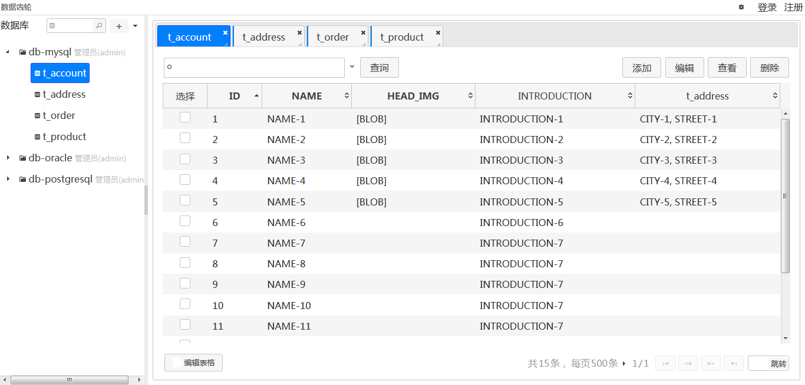
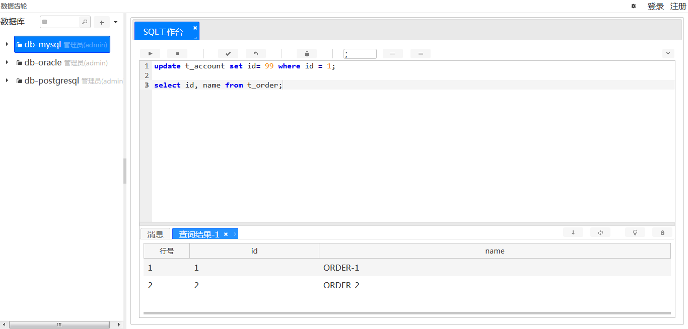
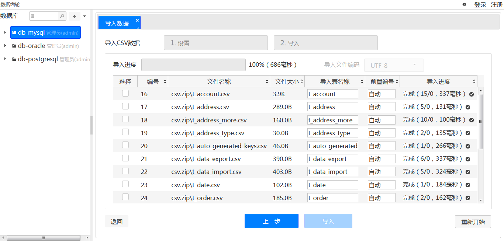
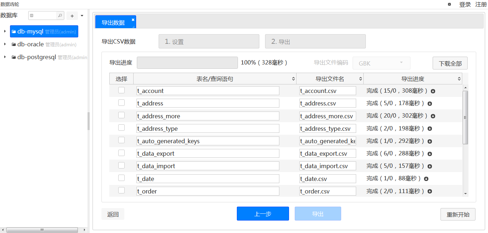
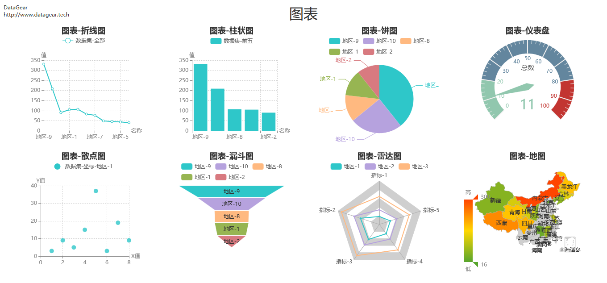
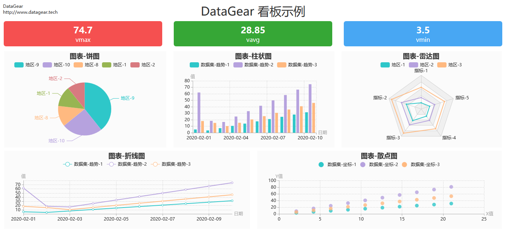

# 数据齿轮（DataGear）

数据齿轮（DataGear）是一款数据管理与可视化分析平台，使用Java语言开发，采用浏览器/服务器架构，支持多种数据库，
主要功能包括数据管理、SQL工作台、数据导入/导出、数据集管理、图表管理、看板管理等。

## 官网

[http://www.datagear.tech](http://www.datagear.tech)

## 文档

[http://www.datagear.tech/documentation](http://www.datagear.tech/documentation)

## 界面

数据管理

SQL工作台

数据导入

数据导出

图表

看板

## 依赖

	Java 6+
	Servlet 3.0+

## 编译

	（执行单元测试编译，需要预先配置单元测试环境）
	mvn clean package

	（不执行单元测试编译，无需预先配置单元测试环境）
	mvn clean package -DskipTests

## 运行

	cd datagear-webappembd/target/datagear-[version]
	
	（Linux环境）
	./startup.sh
	
	（windows环境）
	startup.bat

## 版本发布

1. 以主分支新建版本标记，名称为：v[version]，描述为：version [version]；

2. 切换到版本标记，执行maven构建命令：`mvn clean package` ；

3. 将刚才新建的标记推送到仓库保存；

4. 将构建的程序包（`datagear-webappembd/target/datagear-[version]-packages/`目录内）发布到官网；

5. 切换回主分支，修改`pom.xml`文件中的`version`标签内的版本号为下一个版本；

6. 执行统一修改版本号的maven命令：`mvn -N versions:update-child-modules antrun:run` ；

7. 提交并推送新版本号。