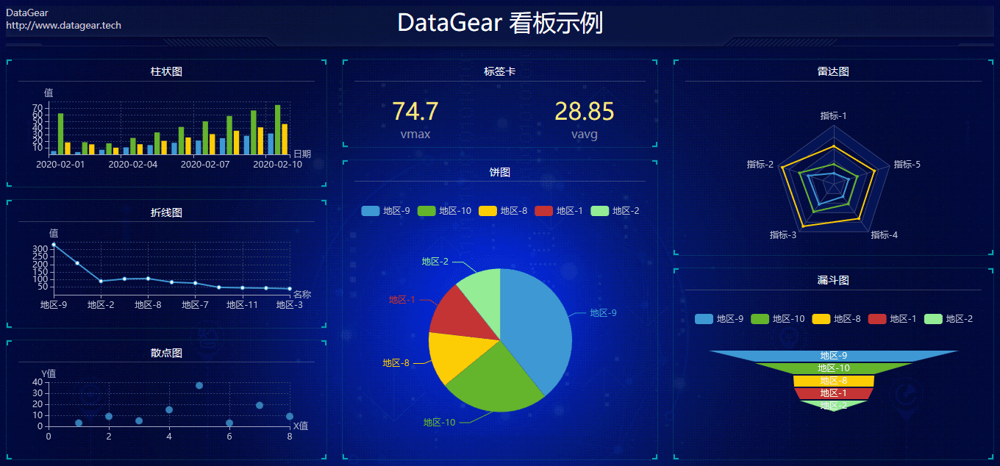

# DataGear

DataGear是一款数据管理与可视化分析平台，使用Java语言开发，采用浏览器/服务器架构，支持多种数据库，
主要功能包括数据管理、SQL工作台、数据导入/导出、数据集管理、图表管理、看板管理等。

## [DataGear 1.7.0 已发布，欢迎官网下载使用！](http://www.datagear.tech)

## 官网

[http://www.datagear.tech](http://www.datagear.tech)

## 文档

[http://www.datagear.tech/documentation](http://www.datagear.tech/documentation)

## 界面

数据管理

SQL工作台

数据导入

数据导出

图表

看板

## 依赖

	Java 8+
	Servlet 3.0+

## 编译

	（执行单元测试编译，需要预先配置单元测试环境）
	mvn clean package

	（不执行单元测试编译，无需预先配置单元测试环境）
	mvn clean package -DskipTests

## 运行

	cd datagear-webappembd/target/datagear-[version]
	
	（Linux环境）
	./startup.sh
	
	（windows环境）
	startup.bat

## 调试
	
	1. 将datagear以maven工程导入至IDE工具；
	2. 将datagear-webapp作为Web应用添加至servlet容器（比如Tomcat）；
	3. 以调试模式运行Servlet容器。
	