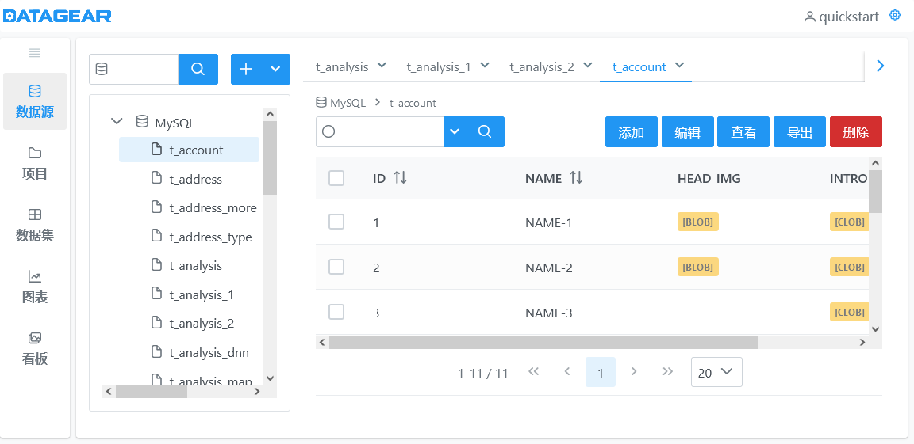
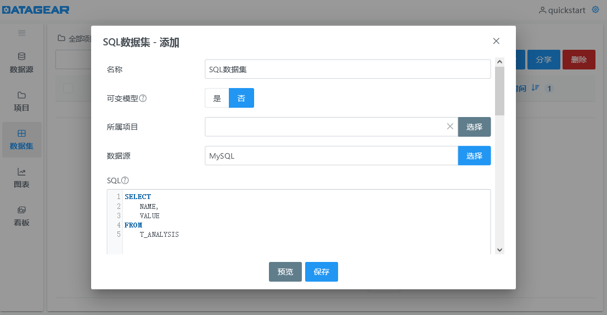

	

<h1 align="center">
	数据可视化分析平台
</h1>
<h2 align="center">
	自由制作任何您想要的数据看板
</h2>

# 简介

DataGear是一款开源免费的数据可视化分析平台，自由制作任何您想要的数据看板，支持接入SQL、CSV、Excel、HTTP接口、JSON等多种数据源。

系统主要功能包括：数据源管理、SQL工作台、数据导入/导出、项目管理、数据集管理、图表管理、看板管理、用户管理、角色管理、数据源驱动管理、图表插件管理等。

## [DataGear 5.1.0 已发布，欢迎官网下载使用！](http://www.datagear.tech)

## [DataGear企业版 1.2.0 正式发布，欢迎试用！](http://www.datagear.tech/pro/)

# 特点

- 安全稳定
 
数年持续开发迭代，稳定运行数千小时无异常，功能流畅不卡顿
 
私有化部署，单体应用，轻量架构，安装简单，运行环境和数据全掌控
 
基于角色的权限控制策略，数据默认私有，可分享共用，保护数据安全
 
越权访问校验、SQL防注入、数据源防护、敏感信息加密存储、日志脱敏处理

- 功能丰富
 
数据源管理支持数据增删改查、导入导出、SQL工作台
 
数据集支持SQL/HTTP/CSV/Excel/JSON/文件，支持定义参数和参数化语法
 
图表支持在一个内绑定多个不同来源的数据集，内置70+开箱即用的常用图表
 
数据看板支持导入HTML模板、可视/源码编辑模式、分享密码、iframe嵌入
 
用户管理、角色管理、数据源驱动管理、图表插件管理等功能

- 易于扩展
 
支持运行时添加数据源驱动，接入任何提供JDBC驱动库的数据库，包括但不限于MySQL、PostgreSQL、Oracle、SQL Server、Elasticsearch、ClickHouse， 以及OceanBase、TiDB、人大金仓、达梦等众多国产数据库
 
支持编写和上传自定义图表插件，扩展系统图表类型，也支持重写和扩展内置图表插件、自定义图表选项，个性化图表展示效果

- 自由制作
 
数据看板采用原生的HTML网页作为模板，支持导入任意HTML/JavaScript/CSS，支持可视化设计，同时支持自由编辑源码
 
支持引入Vue、React、Bootstrap、Tailwind CSS等web前端框架，制作具有丰富交互效果、多端适配的数据看板
 
内置丰富的数据看板API，可制作图表联动、数据钻取、异步加载、交互表单等个性化数据看板

# 功能

# 官网

[http://www.datagear.tech](http://www.datagear.tech)

# 界面

数据源管理

SQL数据集

看板编辑

看板展示

看板展示-图表联动

看板展示-实时图表

看板展示-钻取

看板展示-表单

看板展示-联动异步加载图表

# 技术栈（前后端一体）

- 后端
   
  Spring Boot、Mybatis、Freemarker、Derby、Jackson、Caffeine、Spring Security

- 前端
   
  jQuery、Vue3、PrimeVue、CodeMirror、ECharts、DataTables

# 模块介绍

- datagear-analysis
   数据分析底层模块，定义数据集、图表、看板API

- datagear-connection
   数据库连接支持模块，定义可从指定目录加载JDBC驱动、新建连接的API

- datagear-dataexchange
   数据导入/导出底层模块，定义导入/导出指定数据源数据的API

- datagear-management
   系统业务服务模块，定义数据源、数据分析等功能的服务层API

- datagear-meta
   数据源元信息底层模块，定义解析指定数据源表结构的API

- datagear-persistence
   数据源数据管理底层模块，定义读取、编辑、查询数据源表数据的API

- datagear-util
   系统常用工具集模块

- datagear-web
   系统web模块，定义web控制器、操作页面

- datagear-webapp
   系统web应用模块，定义程序启动类

# 依赖

	Java 8+
	Servlet 3.1+

# 编译

## 准备单元测试环境

1. 安装`MySQL-8.0`数据库，并将`root`用户的密码设置为：`root`（或者修改`test/config/jdbc.properties`配置）

2. 新建测试数据库，名称取为：`dg_test`

3. 使用`test/sql/test-mysql.sql`脚本初始化`dg_test`库

## 执行编译命令

	mvn clean package

或者，也可不准备单元测试环境，直接执行如下编译命令：

	mvn clean package -DskipTests

编译完成后，将在`datagear-webapp/target/datagear-[version]-packages/`内生成程序包。

# 调试
	
1. 将`datagear`以maven工程导入至IDE工具

2. 以调试模式运行`datagear-webapp`模块的启动类`org.datagear.webapp.DataGearApplication`

3. 打开浏览器，输入：`http://localhost:50401`
	
## 调试注意

在调试开发分支前（`dev-*`），建议先备份DataGear工作目录（`[用户主目录]/.datagear`），
因为开发分支程序启动时会修改DataGear工作目录，可能会导致先前使用的正式版程序、以及后续发布的正式版程序无法正常启动。

系统启动时会根据当前版本号自动升级内置数据库（Derby数据库，位于`[用户主目录]/.datagear/derby`目录下），且成功后下次启动时不再自动执行，如果调试时遇到数据库异常，需要查看

	datagear-management/src/main/resources/org/datagear/management/ddl/datagear.sql

文件，从中查找需要更新的SQL语句，手动执行。

然后，手动执行下面更新系统版本号的SQL语句：

	UPDATE DATAGEAR_VERSION SET VERSION_VALUE='当前版本号'
	
例如，对于`4.6.0`版本，应执行：

	UPDATE DATAGEAR_VERSION SET VERSION_VALUE='4.6.0'

系统自带了一个可用于为内置数据库执行SQL语句的简单工具类`org.datagear.web.util.DerbySqlClient`，可以在IDE中直接运行。注意：运行前需要先停止DataGear程序。

# 版权和许可

Copyright 2018-2024 datagear.tech

DataGear is free software: you can redistribute it and/or modify it under the terms of
the GNU Lesser General Public License as published by the Free Software Foundation,
either version 3 of the License, or (at your option) any later version.

DataGear is distributed in the hope that it will be useful, but WITHOUT ANY WARRANTY;
without even the implied warranty of MERCHANTABILITY or FITNESS FOR A PARTICULAR PURPOSE.
See the GNU Lesser General Public License for more details.

You should have received a copy of the GNU Lesser General Public License along with DataGear.
If not, see <https://www.gnu.org/licenses/>.
