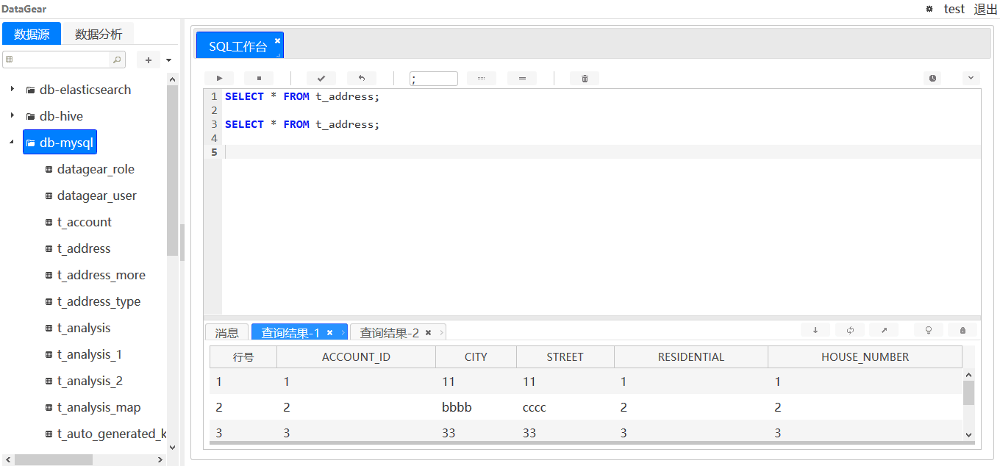
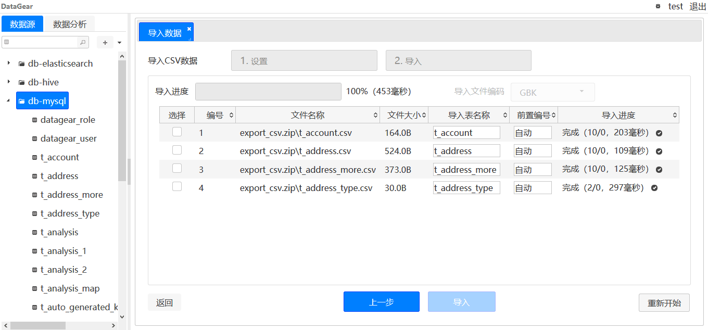
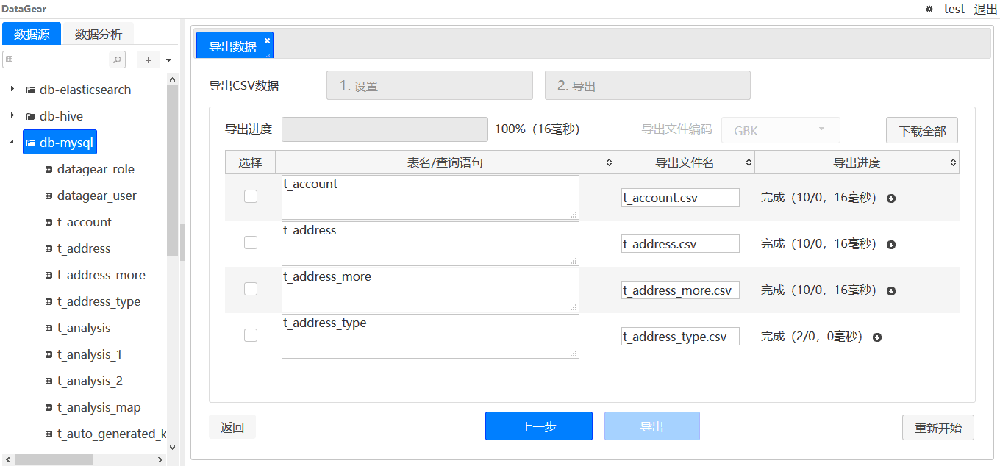
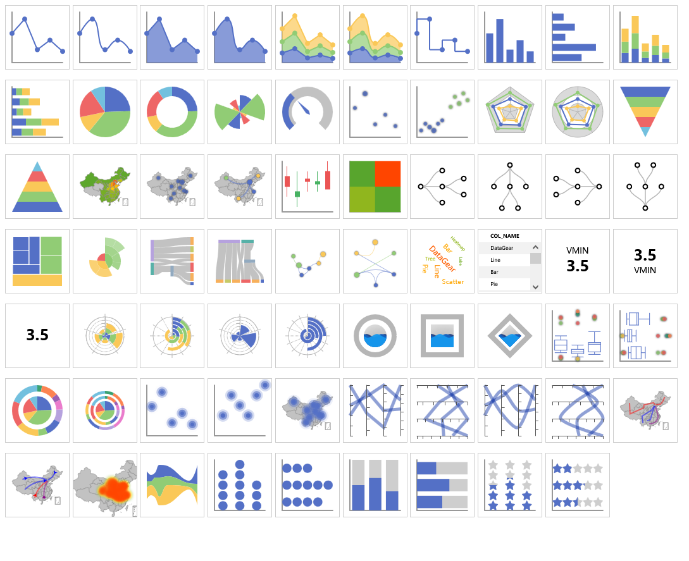

# DataGear

DataGear是一款数据管理与可视化分析平台，使用Java语言开发，采用浏览器/服务器架构，支持多种数据库，
主要功能包括数据管理、SQL工作台、数据导入/导出、数据集管理、图表管理、看板管理等。

## [DataGear 1.8.1 已发布，欢迎官网下载使用！](http://www.datagear.tech)

## 系统特点

- 可管理数据库驱动
 管理员可通过驱动程序管理功能添加数据库驱动程序，无需重启，即可支持连接新数据库。

- 参数化数据集
 可编写动态SQL语句数据集，为其添加参数，构建可交互式图表。

- 多数据源聚合图表
 一个图表可添加多个不同数据源的数据集，将不同数据源的数据聚合展示于同一图表。

- 插件式图表类型
 每一种类型的图表都以图表插件形式提供支持，并内置了大量图表插件，管理员也可上传自定义图表插件，丰富系统图表类型。

- 模板式看板定义
 看板使用原生的HTML网页作为模板，可自由编辑、绑定、异步加载图表，并支持将任意HTML网页导入为看板。

## 官网

[http://www.datagear.tech](http://www.datagear.tech)

## 文档

[http://www.datagear.tech/documentation](http://www.datagear.tech/documentation)

## 交流

QQ群：[916083747](https://jq.qq.com/?_wv=1027&k=ODxiKOOy)

留言板：[http://www.datagear.tech/messageboard](http://www.datagear.tech/messageboard/)

## 界面

数据管理

SQL工作台

数据导入

数据导出

图表

看板

## 依赖

	Java 8+
	Servlet 3.0+

## 编译

	（执行单元测试编译，需要预先配置单元测试环境）
	mvn clean package

	（不执行单元测试编译，无需预先配置单元测试环境）
	mvn clean package -DskipTests

## 运行

	cd datagear-webappembd/target/datagear-[version]
	
	（Linux环境）
	./startup.sh
	
	（windows环境）
	startup.bat

## 调试
	
	1. 将datagear以maven工程导入至IDE工具；
	2. 将datagear-webapp作为Web应用添加至servlet容器（比如Tomcat）；
	3. 以调试模式运行Servlet容器。
	